# DSA in C++ (Striver A-Z)
A repository containing all the detailed concepts of Data Structures and Algorithms in C++

----

## Step 1: Learn the Basics 
## Lec-1 : Basic Things to Know in C++
----
### Imput/Output in C++
A short and simple summary of C++ I/O for beginners – inspired by takeUforward.


#### ✅ 1. Include Libraries
Start your code by adding:
```cpp
#include<iostream>
```
This lets you use cin and cout for input and output.

#### ✅ 2. Basic Program Structure
```cpp
#include<iostream>
int main() {
    // your code here
    return 0;
}
```

#### ✅ 3. Printing Output
Use cout to print:
```cpp
#include<iostream>
int main() {
    std::cout << "Hey, Striver!";
    return 0;
}
```
✅ Use \n or std::endl to print on a new line:
```cpp
std::cout << "Hello\nWorld";
```

#### ✅ 4. Skip std:: every time
Use this to make code shorter:
```cpp
using namespace std;
```
Now you can write cout and cin directly.

####  ✅ 5. Taking Input
Use cin to take input from the user:
```cpp
int x;
cin >> x;
cout << "Value: " << x;
```
✔️ For two inputs:
```cpp
int x, y;
cin >> x >> y;
cout << "x: " << x << " y: " << y;
```

#### ✅ 6. Shortcut to include all libraries
use:
```cpp
#include<bits/stdc++.h>
```
⚠️ Not official C++ standard, but common in coding contests.

----
### DataTypes in C++
#### 1. Built-in Data Types in C++
| Type      | Keyword | Size (Typical) | Example Value         |
|-----------|---------|----------------|------------------------|
| Integer   | `int`   | 4 bytes        | `int x = 10;`          |
| Character | `char`  | 1 byte         | `char c = 'A';`        |
| Float     | `float` | 4 bytes        | `float pi = 3.14;`     |
| Double    | `double`| 8 bytes        | `double d = 3.14159;`  |
| Boolean   | `bool`  | 1 byte         | `bool isOn = true;`    |

#### 2. Type Modifiers
| Modifier   | Use                 | Example                 |
|------------|---------------------|--------------------------|
| `short`    | Smaller int         | `short s = 100;`         |
| `long`     | Larger int          | `long l = 100000;`       |
| `unsigned` | Only positive values| `unsigned int u = 50;`   |

#### 3. Example Code Snippet
```cpp
#include<iostream>
using namespace std;

int main() {
    int age = 21;
    char grade = 'A';
    float temp = 36.5;
    double pi = 3.141592;
    bool passed = true;
    
    cout << "Age: " << age << "\n";
    cout << "Grade: " << grade << "\n";
    cout << "Temperature: " << temp << "\n";
    cout << "Pi: " << pi << "\n";
    cout << "Passed? " << passed << "\n";  // prints 1 for true
    return 0;
}
```

-----

### Conditional Statements in C++
#### ✅ if-else Statement
- if checks a condition.
- If it's true, code inside runs.
- else runs if the condition is false.
 🧪 Example:
```cpp
int age = 10;
if (age >= 18)
    cout << "You are an adult.";
else
    cout << "You are not an adult.";
```
🧾 Output: You are not an adult.

#### ✅ else if Statement
Used when you want to check multiple conditions one after another.
 🧪 Example:
```cpp
int marks = 54;

if (marks < 25)
    cout << "Grade: F";
else if (marks <= 44)
    cout << "Grade: E";
else if (marks <= 49)
    cout << "Grade: D";
else if (marks <= 59)
    cout << "Grade: C";
else if (marks <= 69)
    cout << "Grade: B";
else
    cout << "Grade: A";

```
🧾 Output: Grade: C
👉 Instead of checking both >= and <=, you can just check <= because previous conditions already filter the lower values.

----

### Switch Statement
- Used when you have one variable and want to compare it to many exact values.
- Cleaner and easier to read for multiple fixed-value cases.
- Only works with integer or char values.
- Each case represents one possible value.
- Use break after each case to stop checking further cases.
- default handles any value not matched by cases.

**Example:** Switch Statement
```cpp
int day = 4;

switch(day) {
    case 1: cout << "Monday"; break;
    case 2: cout << "Tuesday"; break;
    case 3: cout << "Wednesday"; break;
    case 4: cout << "Thursday"; break;
    case 5: cout << "Friday"; break;
    case 6: cout << "Saturday"; break;
    case 7: cout << "Sunday"; break;
    default: cout << "Invalid"; 
}
```
Output: Thursday

**Important Points About Switch**
- The expression must be a constant or result in a constant value.
- Works only with int or char types.
- The break keyword is essential to stop fall-through to other cases.
- default case is optional but useful for unexpected values.
- Duplicate case values are not allowed.
- You can nest switch statements but it’s usually discouraged for readability.

----

### Arrays and Strings in C++
**What is an Array?**
An array is a collection of elements of the same data type stored in contiguous memory locations.
- It allows you to store multiple values under one variable name.
- Each element can be accessed using an index starting from 0.

**Why use arrays?**
- To manage and organize multiple related values easily.
- Instead of creating many separate variables, use one array.

**How to declare an array?**
```cpp
type arrayName[size];
```

**Example:**
```cpp
int numbers[5]; // Declares an array of 5 integers
```

**How to initialize an array?**
```cpp
int numbers[5] = {10, 20, 30, 40, 50};
```
**Accessing elements**
- Use the index (starting at 0) to get or set values.
```cpp
cout << numbers[2];  // Output: 30 (3rd element)
numbers[0] = 100;    // Changes 1st element to 100
```

**Example: Array to print 5 numbers**
```cpp
#include <iostream>
using namespace std;

int main() {
    int arr[5] = {1, 2, 3, 4, 5};

    for (int i = 0; i < 5; i++) {
        cout << arr[i] << " ";
    }

    return 0;
}
```
Output: 1 2 3 4 5

**What is a String?**
A string is a sequence of characters.
In C++, there are two main ways to use strings:
- C-style strings (character arrays ending with '\0' null character)
- The C++ string class from the standard library (<string>), which is easier and safer.

**1. C-Style Strings (Character Arrays)**
A string is stored as an array of characters ending with a special '\0' (null) character that marks the end.

- Declared like this:
```cpp
char name[20] = "Arya";  // array of chars with a string
```

**Example: Print a C-style string**
```cpp
#include <iostream>
using namespace std;

int main() {
    char name[] = "Arya";
    cout << name << endl;  // Output: Arya
    return 0;
}
```
**Important:** Always make sure there is enough space for the characters + the null '\0' character.

**2. C++ string Class**
- More powerful and easier to work with than C-style strings.
- Automatically manages memory and size.
- Include the string library: #include <string>

Declared like this:
```cpp
#include <iostream>
#include <string>
using namespace std;

int main() {
    string name = "Arya";
    cout << name << endl;  // Output: Arya

    // You can also concatenate strings easily:
    string greeting = "Hello, " + name + "!";
    cout << greeting << endl;  // Output: Hello, Arya!

    return 0;
}
```
**Summary**
| Concept       | Description                                   | Example                  |
|---------------|-----------------------------------------------|--------------------------|
| Array         | Collection of same-type elements accessed by index | `int arr[3] = {1,2,3};` |
| C-Style String| Array of characters ending with '\0'           | `char str[] = "Hi";`     |
| C++ String    | Class that stores and manages text easily       | `string s = "Hello";`    |

----
### For-Loop
🧠 What is a For Loop?
A for loop is used when you want to repeat a task multiple times.

It has 3 main parts:

- Initialization – start a counter
- Condition – keep looping while this is true
- Increment/Decrement – change counter each time

#### ✅ Basic Syntax:
```cpp
for (initialization; condition; update) {
    // code to repeat
}
```
**🔁 Example 1: Print 1 to 10**
```cpp
#include <iostream>
using namespace std;

int main() {
    for (int i = 1; i <= 10; i++) {
        cout << "i = " << i << endl;
    }
    return 0;
}
```
📤 Output: 
```cpp
i = 1
i = 2
...
i = 10
```

**🔁 Example 2: Nested For Loop**
- Used when we need loops inside loops (like rows & columns):
```cpp
for (int i = 0; i < 3; i++) {
    for (int j = 0; j < 3; j++) {
        cout << "i = " << i << ", j = " << j << endl;
    }
}
```

**🔁 Example 3: For Loop with If-Else**
- Print if a number is even or odd:
```cpp
for (int i = 1; i <= 5; i++) {
    if (i % 2 == 0)
        cout << i << " is Even" << endl;
    else
        cout << i << " is Odd" << endl;
}
```

**🔁 Example 4: Custom Increment**
- Increase by 5 instead of 1:
```cpp
for (int i = 1; i <= 25; i += 5) {
    cout << "i = " << i << endl;
}
```

**📤 Output:**
```cpp
i = 1
i = 6
i = 11
i = 16
i = 21
```

----

### While Loop
🌀 What is a while loop?A while loop is used to repeat code as long as a condition is true.

#### ✅ How it works:
- Check the condition.
- If it's true, run the loop body.
- Repeat until the condition becomes false.

**Basic Syntax**
```cpp
while (condition) {
    // code to repeat
}
```

**📌 Example 1: Print numbers from 1 to 5**
```cpp
#include <iostream>
using namespace std;

int main() {
    int i = 1;
    while (i <= 5) {
        cout << i << " ";
        i++;
    }
    return 0;
}
```
**Output:**
```cpp
1 2 3 4 5
```

**📌 Example 2: Factorial of a number**
```cpp
#include <iostream>
using namespace std;

int main() {
    int n = 5;
    int fact = 1;

    while (n > 0) {
        fact *= n;
        n--;
    }

    cout << "Factorial is: " << fact << endl;
    return 0;
}

```
**Output:**
```cpp
Factorial is: 120
```

#### 🛑 break - Exit loop early
```cpp
int i = 1;
while (i <= 10) {
    if (i == 4) break;
    cout << i << " ";
    i++;
}
```
**Output:**
```cpp
1 2 3
```

#### 🔄 continue - Skip current loop iteration
```cpp
int i = 0;
while (i < 6) {
    i++;
    if (i % 2 == 0) continue; // skip even numbers
    cout << i << " ";
}
```
**Output:**
```cpp
1 3 5
```

#### ⚠️ Warning: Infinite loop
If the condition never becomes false, the loop runs forever.
```cpp
while (true) {
    // runs forever unless we use break
}
```
#### ✅ Use while when:
- You don't know in advance how many times to repeat.
- You want to keep running until a condition is false.

----

### Functions (Pass by Values and Reference)
#### 🧠 What is a Function?
A function is a reusable block of code that performs a specific task.

#### ✅ Why use functions?
- To avoid repeating code.
- To divide big programs into small, manageable pieces.

**📌 Function Syntax:**
```cpp
returnType functionName(parameters) {
    // function body
    return value; // if needed
}
```

#### 🎯 Two Ways to Pass Data to Functions:
1. Pass by Value (copy is sent)
2. Pass by Reference (actual variable is sent)

**🔹 1. Pass by Value**
👉 A copy of the variable is passed.
👉 Changes made inside the function don’t affect the original variable.

**🧪 Example:**
```cpp
#include <iostream>
using namespace std;

void changeValue(int x) {
    x = 100;
    cout << "Inside function: " << x << endl;
}

int main() {
    int a = 5;
    changeValue(a);
    cout << "Outside function: " << a << endl;
    return 0;
}
```
**🔎 Output:**
```cpp
Inside function: 100  
Outside function: 5
```
🎯 Even though x is changed to 100 inside the function, the original a remains 5 because only a copy was passed.

**🔹 2. Pass by Reference**
👉 The actual variable is passed using &.
👉 Changes inside the function affect the original variable.

**🧪 Example:**
```cpp
#include <iostream>
using namespace std;

void changeValue(int &x) {
    x = 100;
    cout << "Inside function: " << x << endl;
}

int main() {
    int a = 5;
    changeValue(a);
    cout << "Outside function: " << a << endl;
    return 0;
}

```
**🔎 Output:**
```cpp
Inside function: 100  
Outside function: 100
```
🎯 Now the change reflects outside the function too, because the actual variable was modified.


#### 🧪 Quick Comparison Table

| Feature           | Pass by Value                     | Pass by Reference                  |
|-------------------|------------------------------------|-------------------------------------|
| What is passed?   | A copy of the variable             | The actual variable                 |
| Changes reflect?  | ❌ No                              | ✅ Yes                              |
| Use case          | When you don't want original data to change | When you want to modify original data |

#### 💡 Extra Tip: Use const with reference for safety
If you want to pass large data (like arrays or strings) efficiently but don’t want to change them, use:
```cpp
void showData(const int &x) {
    cout << x;
}
```
This avoids copying and also protects the original value.

#### 🧠 Summary:
- Pass by Value: Makes a copy; original remains safe.
- Pass by Reference: Direct access; can modify original.
- Use & in parameter to pass by reference.
- Use const & when passing by reference without changing value.

----

### ✅ Time and Space Complexity 
#### 📌 What is Time Complexity?
- Time complexity measures how the time to run an algorithm increases with input size.
- It does not refer to actual time taken on a machine (as that varies with hardware).
- Big O notation is used to express time complexity, e.g., O(N), O(N²), O(log N).

#### 💡 Why Not Use Actual Time?
- Time differs on different machines (e.g., old PC vs. modern MacBook).
- So we measure how steps increase with input size N, rather than seconds or milliseconds.

#### 🧠 How to Represent Time Complexity?
We follow:
Use Big O notation to describe the upper bound of steps.
**For example**, a loop running 3N steps:
✅ O(3N) → simplifies to ✅ O(N) (drop constant).

#### ⚙️ Rules for Calculating Time Complexity
- Always use the worst-case scenario:
**Best case:** Fewest steps
**Worst case:** Maximum steps → use this
**Average case:** Middle ground, not usually considered unless explicitly asked

**Ignore constants:**
O(4N³ + 3N² + 8) → becomes O(N³) as N grows large

**Ignore lower-order terms:**
Same example: N² and constant 8 become negligible as N increases

#### ⚖️ Other Notations (Less Used in Interviews)

| Notation | Meaning                    |
|----------|----------------------------|
| **Big O (O)** | Worst-case time complexity     |
| **Theta (θ)** | Average-case (tight bound)     |
| **Omega (Ω)** | Best-case time complexity      |

👉 These are less important in interviews – Big O is the key focus.

**✅ Example Questions**

📘 Q1: Nested loop (both run N times)
```cpp
for (int i = 0; i < N; i++)
    for (int j = 0; j < N; j++)
        cout << i << " " << j;
```
- Outer loop → N times
- Inner loop → N times
- Total → N * N = N²
- ✅ Time Complexity: O(N²)

📘 Q2: Inner loop runs from 0 to i
```cpp
for (int i = 0; i < N; i++)
    for (int j = 0; j <= i; j++)
        cout << i << " " << j;
```
- Steps: 1 + 2 + 3 + ... + N = N(N+1)/2
- ✅ Time Complexity: O(N²) (drop constants)

#### 🧠 What is Space Complexity?
- Measures how much memory is used.
Includes:
- Auxiliary space: Extra memory for variables, arrays, stacks
- Input space: Memory for storing input data

**📘 Example:**
```cpp
int a, b; // input space
int c = a + b; // auxiliary space
```
- Total space = 3 units → Space Complexity = O(1)
📘 If you use an array of size N → Space Complexity = O(N)

#### 🚫 Avoiding Bad Practice
- Don’t overwrite inputs (e.g., b = a + b) just to save space
- In interviews, NEVER manipulate given data unless told to do so

#### ✅ Key Takeaways
- Use Big O notation for both time and space.
- Always analyze the worst-case scenario.
- Ignore constants and lower-order terms.
- Don’t manipulate inputs for better space complexity unless allowed.

----

## Lec-2 : Build-Up Logical Thinking 
----
### Must Do Patterns

#### Pattern-1


**Code**
```cpp
#include <iostream>
using namespace std;

int main() {
    for (int i = 0; i < 5; ++i) {
        cout << "*****" << endl;
    }
    return 0;
}
```
#### Pattern-2
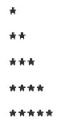

**Code**
```cpp
#include <iostream>
using namespace std;

int main() {
    for (int i = 1; i <= 5; i++) {
        for(int j=1; j<=i; j++){
            cout<<"*";
        }
        cout<<endl;
    }
}
```
#### Pattern-3
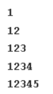

**Code**
```cpp
#include <iostream>
using namespace std;

int main() {
    for (int i = 1; i <= 5; i++) {
        for(int j=1; j<=i; j++){
            cout<<j;
        }
        cout<<endl;
    }

}
```
#### Pattern-4
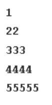

**Code**
```cpp
#include <iostream>
using namespace std;

int main() {
    for (int i = 1; i <= 5; i++) {
        for(int j=1; j<=i; j++){
            cout<<i;
        }
        cout<<endl;
    }

}
```
#### Pattern-5


**Code**
```cpp
#include <iostream>
using namespace std;

int main() {
    for (int i = 5; i >=1; i--) {
        for(int j=i; j>=1; j--){
            cout<<"*";
        }
        cout<<endl;
    }

}
```
#### Pattern-6
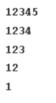

**Code**
```cpp
#include <iostream>
using namespace std;

int main() {
    
    for (int i = 5; i >=1; i--) {
        for(int j=1; j<=i; j++){
            cout<<j;
        }
        
        cout<<endl;
    }

}
```
#### Pattern-7


**Code**
```cpp

#include <iostream>
using namespace std;

int main() {
    int n = 5;
    for(int i = 1; i <= n; i++) {
        // Print spaces
        for(int j = 1; j <= n - i; j++)
            cout << " ";
        // Print stars
        for(int j = 1; j <= 2*i - 1; j++)
            cout << "*";
        cout << endl;
    }
    return 0;
}
```
#### Pattern-8
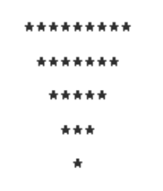

**Code**
```cpp

#include <iostream>
using namespace std;

int main() {
    int n = 5;
    for(int i = n; i >= 1; i--) {
        // Print spaces
        for(int j = 1; j <= n - i; j++)
            cout << " ";
        // Print stars
        for(int j = 1; j <= 2*i - 1; j++)
            cout << "*";
        cout << endl;
    }
    return 0;
}
```
#### Pattern-9
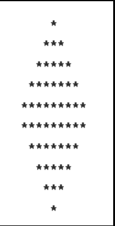

**Code**
```cpp

#include <iostream>
using namespace std;

int main() {
    int n = 5;

    // Upper part
    for(int i = 1; i <= n; i++) {
        for(int j = 1; j <= n - i; j++) cout << " ";
        for(int j = 1; j <= 2*i - 1; j++) cout << "*";
        cout << endl;
    }

    // Lower part
    for(int i = n - 1; i >= 1; i--) {
        for(int j = 1; j <= n - i; j++) cout << " ";
        for(int j = 1; j <= 2*i - 1; j++) cout << "*";
        cout << endl;
    }

    return 0;
}
```
#### Pattern-10


**Code**
```cpp
#include <iostream>
using namespace std;

int main() {
    int n = 5;

    // Upper part
    for(int i = 1; i <= n; i++) {
        for(int j = 1; j <= i; j++) cout << "*";
        cout << endl;
    }

    // Lower part
    for(int i = n - 1; i >= 1; i--) {
        for(int j = 1; j <= i; j++) cout << "*";
        cout << endl;
    }

    return 0;
}
```
#### Pattern-11
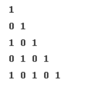


**Code**
```cpp

#include <iostream>
using namespace std;

int main() {
    int n = 5;
    for(int i = 1; i <= n; i++) {
        for(int j = 1; j <= i; j++) {
            cout << ((i + j) % 2) << " ";
        }
        cout << endl;
    }
    return 0;
}
```

#### Pattern-12
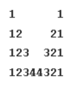
**Code**
```cpp
#include <iostream>
using namespace std;

int main() {
    int n = 5;
    for(int i = 1; i <= n; i++) {
        // Increasing numbers
        for(int j = 1; j <= i; j++) cout << j;
        // Spaces
        for(int j = 1; j <= 2*(n - i); j++) cout << " ";
        // Decreasing numbers
        for(int j = i; j >= 1; j--) cout << j;
        cout << endl;
    }
    return 0;
}
```
#### Pattern-13
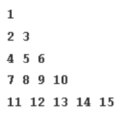

**Code**
```cpp
#include <iostream>
using namespace std;

int main() {
    int n = 5, count = 1;
    for(int i = 1; i <= n; i++) {
        for(int j = 1; j <= i; j++) {
            cout << count++ << " ";
        }
        cout << endl;
    }
    return 0;
}

```
#### Pattern-14
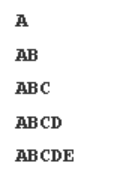


**Code**
```cpp
#include <iostream>
using namespace std;

int main() {
    int n = 5;
    for(int i = 1; i <= n; i++) {
        for(char ch = 'A'; ch < 'A' + i; ch++) {
            cout << ch;
        }
        cout << endl;
    }
    return 0;
}


```

#### Pattern-15
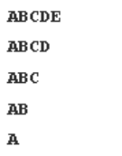


**Code**
```cpp
#include <iostream>
using namespace std;

int main() {
    int n = 5;
    for(int i = n; i >= 1; i--) {
        for(char ch = 'A'; ch < 'A' + i; ch++) {
            cout << ch;
        }
        cout << endl;
    }
    return 0;
}


```
#### Pattern-16
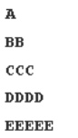


**Code**
```cpp
#include <iostream>
using namespace std;

int main() {
    int n = 5;
    for(int i = 0; i < n; i++) {
        char ch = 'A' + i;
        for(int j = 0; j <= i; j++) {
            cout << ch;
        }
        cout << endl;
    }
    return 0;
}

```
#### Pattern-17
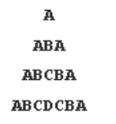

**Code**
```cpp
#include <iostream>
using namespace std;

int main() {
    int n = 5;
    for(int i = 1; i <= n; i++) {
        // Spaces
        for(int j = 1; j <= n - i; j++) cout << " ";
        // Increasing characters
        for(char ch = 'A'; ch < 'A' + i; ch++) cout << ch;
        // Decreasing characters
        for(char ch = 'A' + i - 2; ch >= 'A'; ch--) cout << ch;
        cout << endl;
    }
    return 0;
}

```
#### Pattern-18
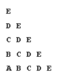


**Code**
```cpp
#include <iostream>
using namespace std;

int main() {
    int n = 5;
    for(int i = 0; i < n; i++) {
        char ch = 'E' - i;
        for(int j = 0; j <= i; j++) {
            cout << (char)(ch + j) << " ";
        }
        cout << endl;
    }
    return 0;
}

```

#### Pattern-19
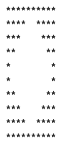


**Code**
```cpp
#include <iostream>
using namespace std;

int main() {
    int n = 5;

    // Upper Half
    for(int i = 0; i < n; i++) {
        for(int j = 0; j < i; j++) cout << " ";
        for(int j = 0; j < 2*(n - i) - 1; j++) cout << "*";
        cout << endl;
    }

    // Lower Half
    for(int i = 1; i < n; i++) {
        for(int j = 0; j < n - i - 1; j++) cout << " ";
        for(int j = 0; j < 2*i + 1; j++) cout << "*";
        cout << endl;
    }

    return 0;
}

```
#### Pattern-20
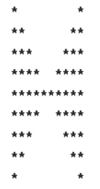

**Code**
```cpp
#include <iostream>
using namespace std;

int main() {
    int n = 5;

    // Upper Half
    for(int i = 1; i <= n; i++) {
        for(int j = 1; j <= n - i; j++) cout << " ";
        for(int j = 1; j <= i; j++) cout << "* ";
        cout << endl;
    }

    // Lower Half
    for(int i = n - 1; i >= 1; i--) {
        for(int j = 1; j <= n - i; j++) cout << " ";
        for(int j = 1; j <= i; j++) cout << "* ";
        cout << endl;
    }

    return 0;
}
```
#### Pattern-21
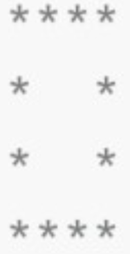

**Code**
```cpp
#include <iostream>
using namespace std;

int main() {
    int n = 5;

    for(int i = 0; i < n; i++) {
        for(int j = 0; j < n; j++) {
            if(i == 0 || i == n - 1 || j == 0 || j == n - 1)
                cout << "* ";
            else
                cout << "  ";
        }
        cout << endl;
    }

    return 0;
}

```
#### Pattern-22
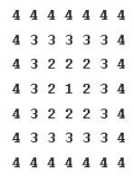


**Code**
```cpp
#include <iostream>
using namespace std;

int main() {
    int n = 4;

    int size = 2 * n - 1;
    for(int i = 0; i < size; i++) {
        for(int j = 0; j < size; j++) {
            int top = i;
            int left = j;
            int right = (2 * n - 2) - j;
            int bottom = (2 * n - 2) - i;
            int min_dist = min(min(top, bottom), min(left, right));
            cout << n - min_dist << " ";
        }
        cout << endl;
    }

    return 0;
}


```
-----
## Lec 3: C++ STL
-----
### What is STL?
C++ STL (Standard Template Library) is a collection of pre-written code that helps you use data structures (like vectors, stacks, queues, maps) and algorithms (like sort, binary search) easily and quickly without writing them from scratch.It's super useful in coding, especially in DSA and competitive programming, because it saves time and makes your code faster and cleaner.

### What is an unordered_set?
- It stores unique elements (no duplicates).
- The elements are not stored in any order.
- Most operations (like insert, find) take O(1) time on average.

**🔹 Syntax:**
```cpp
unordered_set<int> s;
```
### 🔹 Common Functions of `unordered_set`

| Function     | Description                     |
|--------------|---------------------------------|
| `insert(x)`  | Adds element `x` to the set     |
| `erase(x)`   | Removes element `x` from the set|
| `find(x)`    | Checks if `x` is present        |
| `count(x)`   | Returns 1 if `x` exists, else 0 |
| `size()`     | Returns the number of elements  |
| `clear()`    | Removes all elements            |
| `empty()`    | Returns `true` if set is empty  |

**Example**
```cpp
#include <iostream>
#include <unordered_set>
using namespace std;

int main() {
    unordered_set<int> s;

    s.insert(10);
    s.insert(20);
    s.insert(30);

    // Print all elements
    for (int x : s) {
        cout << x << " ";
    }
    cout << endl;

    // Check if 20 is present
    if (s.find(20) != s.end())
        cout << "20 is present\n";

    s.erase(10);  // Remove 10

    cout << "Size: " << s.size() << endl;

    s.clear();  // Remove all
    cout << "Is empty? " << s.empty() << endl;

    return 0;
}
```

**Output**
```cpp
30 20 10 
20 is present
Size: 2
Is empty? 1

```
----
### ✅ What is a Vector in C++?
A vector is like a resizable array. It can grow or shrink in size when you add or remove elements. It stores data in contiguous memory, just like an array.
**📌 Syntax:**
```cpp
vector<int> v;       // Vector of integers
vector<string> names; // Vector of strings
```
### 🔹 Common Functions (C++ STL Vector)

| Function         | Purpose                              |
|------------------|---------------------------------------|
| `push_back(x)`   | Adds `x` at the end                   |
| `pop_back()`     | Removes the last element              |
| `insert(pos, x)` | Inserts `x` at position `pos`         |
| `erase(pos)`     | Removes element at position `pos`     |
| `front()`        | Returns the first element             |
| `back()`         | Returns the last element              |
| `clear()`        | Deletes all elements                  |
| `empty()`        | Checks if the vector is empty         |
| `size()`         | Returns the number of elements        |
| `begin()/end()`  | Iterators for start and end positions |

**Example**
```cpp
#include <iostream>
#include <vector>
using namespace std;

int main() {
    vector<int> v;

    // Add elements
    v.push_back(10);
    v.push_back(20);

    // Show elements
    cout << "Vector: ";
    for (int i : v)
        cout << i << " ";

    // Remove last element
    v.pop_back();

    cout << "\nAfter pop_back: ";
    for (int i : v)
        cout << i << " ";

    return 0;
}

```

**Output**
```cpp
Vector: 10 20 
After pop_back: 10

```
----
### 🔹 What is a set in C++?
A set is a container in C++ STL that:
- Stores only unique elements
- Stores elements in sorted order
- Allows fast insert, search, and delete (average case: O(log n))
- Internally uses balanced binary search trees (like Red-Black tree)
**Syntax**
```cpp
set<int> s;
set<string> names;
```

### 🧮 C++ STL `set` – Common Functions

| Function            | Purpose                                   |
|---------------------|-------------------------------------------|
| `insert(x)`         | Adds element `x` to the set               |
| `find(x)`           | Returns iterator to `x` if present        |
| `erase(x)`          | Removes element `x`                       |
| `begin()` / `end()` | Iterators to first and after-last element |
| `count(x)`          | Checks if `x` exists (returns 1 or 0)     |
| `clear()`           | Deletes all elements                      |
| `size()`            | Returns number of elements                |
| `empty()`           | Checks if set is empty                    |

  
**Example**
```cpp
#include <bits/stdc++.h>
using namespace std;

int main() {
    set<int> s;

    // Insert elements
    s.insert(10);
    s.insert(20);
    s.insert(30);
    s.insert(20); // duplicate, will be ignored

    cout << "Elements in set: ";
    for (auto x : s) {
        cout << x << " ";
    }

    // Check if element exists
    if (s.find(20) != s.end())
        cout << "\n20 is present in set.";

    // Erase an element
    s.erase(10);

    cout << "\nSet after deleting 10: ";
    for (auto x : s) {
        cout << x << " ";
    }

    cout << "\nSize: " << s.size();

    // Clear all elements
    s.clear();

    cout << "\nIs set empty? " << (s.empty() ? "Yes" : "No") << endl;

    return 0;
}

```

**Output**
```cpp
Elements in set: 10 20 30
20 is present in set.
Set after deleting 10: 20 30
Size: 2
Is set empty? Yes

```
----

###  📍 unordered_multiset

- 🔹 Stores duplicate values (like multiset), but in no particular order.
- 🔹 Fast for lookup and insertion.


### 🧮 C++ STL unordered_multicast

| Operation   | Purpose                                          |
| ----------- | ------------------------------------------------ |
| `insert(x)` | Adds element `x` (duplicates allowed, unordered) |
| `count(x)`  | Count of `x`                                     |
| `erase(x)`  | Removes all `x`                                  |
| `find(x)`   | Iterator to any `x`                              |
| `clear()`   | Remove all elements                              |
| `size()`    | Number of elements                               |

  
**Example**
```cpp
#include <iostream>
#include <unordered_multiset>
using namespace std;

int main() {
    unordered_multiset<int> ums = {2, 3, 2, 5};
    for (int x : ums) cout << x << " ";
    return 0;
}

```
------
###  📍 multiset
- 🔹 Stores elements in sorted order.
- 🔹 Allows duplicate elements.

### 🧮 C++ STL multiset
| Operation           | Purpose                          |
| ------------------- | -------------------------------- |
| `insert(x)`         | Adds `x` (keeps elements sorted) |
| `count(x)`          | Count of `x`                     |
| `erase(x)`          | Removes all `x`                  |
| `find(x)`           | Iterator to first `x`            |
| `begin()` / `end()` | Iterators for traversal          |

  
**Example**
```cpp
#include <iostream>
#include <set>
using namespace std;

int main() {
    multiset<int> ms = {3, 1, 2, 2};
    for (int x : ms) cout << x << " "; // Output: 1 2 2 3
    return 0;
}


```
------

###  📍 unordered_map
- 🔹 Stores key-value pairs.
- 🔹 No particular order. Fast access.
- 🔹 Keys are unique.

### 🧮 C++ STL unordered_map

| Operation      | Purpose                 |
| -------------- | ----------------------- |
| `m[key] = val` | Insert/update key-value |
| `find(key)`    | Iterator to key         |
| `erase(key)`   | Removes key             |
| `count(key)`   | 1 if exists, else 0     |
| `clear()`      | Remove all entries      |

  
**Example**
```cpp
#include <unordered_map>
using namespace std;

unordered_map<string, int> umap;
umap["apple"] = 10;
umap["banana"] = 5;


```
------

###  📍 unordered_multimap
🔹 Stores key-value pairs like unordered_map, but allows duplicate keys.

### 🧮 C++ STL unordered_multimap

| Operation        | Purpose                             |
| ---------------- | ----------------------------------- |
| `insert({k,v})`  | Insert duplicate keys (unordered)   |
| `equal_range(k)` | Range of values for key             |
| `find(k)`        | Iterator to one of the key’s values |

  
**Example**
```cpp
#include <unordered_map>
using namespace std;

unordered_multimap<string, int> ump;
ump.insert({"apple", 10});
ump.insert({"apple", 20});


```
------

###  📍 queue
🔹 FIFO (First In First Out) structure.

🔹 Insert at the back, remove from the front.

### 🧮 C++ STL queue

| Operation | Purpose                 |
| --------- | ----------------------- |
| `push(x)` | Add to back             |
| `pop()`   | Remove front            |
| `front()` | Access front            |
| `empty()` | Check if queue is empty |

**Example**
```cpp
#include <queue>
using namespace std;

queue<int> q;
q.push(1);
q.push(2);
q.pop();  // Removes 1


```
------

###  📍 stack
🔹 LIFO (Last In First Out) structure.

🔹 Insert and remove at the top.

### 🧮 C++ STL stack

| Operation | Purpose                 |
| --------- | ----------------------- |
| `push(x)` | Push on top             |
| `pop()`   | Remove top              |
| `top()`   | View top                |
| `empty()` | Check if stack is empty |


  
**Example**
```cpp
#include <stack>
using namespace std;

stack<int> s;
s.push(10);
s.pop(); // Removes 10


```
------

###  📍 deque
🔹 Double-ended queue.

🔹 Insert and remove from both front and back.

| Operation            | Purpose         |
| -------------------- | --------------- |
| `push_front(x)`      | Insert at front |
| `push_back(x)`       | Insert at back  |
| `pop_front()`        | Remove front    |
| `pop_back()`         | Remove back     |
| `front()` / `back()` | Access ends     |

  
**Example**
```cpp
#include <deque>
using namespace std;

deque<int> dq;
dq.push_front(1);
dq.push_back(2);
dq.pop_back();  // Removes 2


```
------

###  📍 priority_queue
🔹 A max-heap by default (largest element on top).

🔹 Used for getting max elements efficiently.

| Operation | Purpose                           |
| --------- | --------------------------------- |
| `push(x)` | Add to queue                      |
| `top()`   | View top element (max by default) |
| `pop()`   | Remove top                        |
| `empty()` | Check if empty                    |


  
**Example**
```cpp
#include <queue>
using namespace std;

priority_queue<int> pq;
pq.push(5);
pq.push(10);
cout << pq.top(); // 10

```
------


###  📍 multimap
🔹 Like a map but allows duplicate keys.

🔹 Sorted based on keys.

| Operation        | Purpose                               |
| ---------------- | ------------------------------------- |
| `insert({k,v})`  | Duplicate keys allowed, sorted by key |
| `equal_range(k)` | Returns all pairs with key `k`        |

**Example**
```cpp
#include <map>
using namespace std;

multimap<string, int> mm;
mm.insert({"apple", 1});
mm.insert({"apple", 2});


```
------

###  📍 list
🔹 Doubly linked list.

🔹 Fast insertion and deletion from anywhere.

| Operation        | Purpose            |
| ---------------- | ------------------ |
| `push_back(x)`   | Add to end         |
| `push_front(x)`  | Add to front       |
| `insert(pos, x)` | Insert at position |
| `remove(x)`      | Remove all `x`     |

  
**Example**
```cpp
#include <list>
using namespace std;

list<int> l;
l.push_back(1);
l.push_front(2);

```
------

###  📍 next_permutation()
🔹 Changes array to the next lexicographic permutation.
 
**Example**
```cpp
#include <algorithm>
using namespace std;

vector<int> v = {1, 2, 3};
next_permutation(v.begin(), v.end());  // v = {1, 3, 2}


```
------

###  📍 __builtin_popcount()
🔹 Counts the number of 1s in binary representation of a number.

🔹 Very useful in bit manipulation problems.
  
**Example**
```cpp
#include <iostream>
using namespace std;

int x = 7; // 111 in binary
cout << __builtin_popcount(x); // Output: 3


```
------


### 📍 sort()
🔹 Sorts a container in ascending order.

🔹 Can pass custom comparator for descending.

  
**Example**
```cpp
#include <algorithm>
vector<int> v = {3, 1, 2};
sort(v.begin(), v.end()); // v = {1, 2, 3}

```
------


### 📍 min_element()
🔹 Returns iterator to the minimum element in the range.                

  
**Example**
```cpp
#include <algorithm>
vector<int> v = {5, 1, 3};
cout << *min_element(v.begin(), v.end()); // 1


```
------

### 📍 max_element()
🔹 Returns iterator to the maximum element in the range.             

  
**Example**
```cpp
#include <algorithm>
vector<int> v = {5, 1, 3};
cout << *max_element(v.begin(), v.end()); // 5


```
### 🧠 STL Utility Functions
| Function                | Description                       | Example                                |
| ----------------------- | --------------------------------- | -------------------------------------- |
| `next_permutation()`    | Next lexicographic permutation    | `next_permutation(v.begin(), v.end())` |
| `__builtin_popcount(x)` | Counts set bits in binary of `x`  | `__builtin_popcount(7)` → `3`          |
| `sort()`                | Sorts elements in ascending order | `sort(v.begin(), v.end())`             |
| `min_element()`         | Iterator to smallest element      | `*min_element(v.begin(), v.end())`     |
| `max_element()`         | Iterator to largest element       | `*max_element(v.begin(), v.end())`     |


-----

## Lec-4 : Know the Basic Maths 
-----

### Count digits in a number
🔢 Problem Statement
- Given an integer N, count how many digits it has.

**✅ Examples:**
- Input: 12345 → Output: 5 (since it has 5 digits)
- Input: 7789 → Output: 4 (since it has 4 digits)

**💡 Approach 1: Brute Force (Using Loop)**
🧠 Intuition:
- We can repeatedly divide the number by 10, and each time we do that, we remove one digit from the end.
- We keep doing this until the number becomes 0 and count how many times this happens.

**🧮 Steps:**
- Initialize a counter = 0.
- While N > 0:
- Increment counter by 1.
- Remove last digit of N by doing N = N / 10.
- Return the counter.

**🧾 C++ Code:**
```cpp
#include <iostream>
using namespace std;

int countDigits(int n) {
    int cnt = 0;
    while(n > 0) {
        cnt++;         // count this digit
        n = n / 10;     // remove the last digit
    }
    return cnt;
}

int main() {
    int N = 12345;
    cout << "Number: " << N << endl;
    cout << "Digit count: " << countDigits(N) << endl;
    return 0;
}
```
**✅ Output:**
```cpp
Number: 12345
Digit count: 5
```

**⏱️ Time Complexity: O(log N)**
Because each time we divide by 10, the number reduces significantly.

**🧠 Space Complexity: O(1)**
Just one counter variable is used.

**💡 Optimal (Using Logarithm)**
🧠 Intuition:
- Mathematically, the number of digits in a number N is:
- 📌 digits = floor(log10(N)) + 1

**🧮 Why?**

- log10(N) gives us how many digits fit into powers of 10.
- Adding 1 accounts for the total number of digits.
- We take floor by converting it to an int in C++.
'⚠️ Important: This only works for positive numbers (N > 0). For N = 0, you can return 1 manually.'

**🧾 C++ Code:**
```cpp
#include <iostream>
#include <cmath>
using namespace std;

int countDigits(int n) {
    if (n == 0) return 1;  // Special case
    return (int)(log10(n) + 1);
}

int main() {
    int N = 12345;
    cout << "Number: " << N << endl;
    cout << "Digit count: " << countDigits(N) << endl;
    return 0;
}

```
**✅ Output:**
```cpp
Number: 12345
Digit count: 5

```

**⏱️ Time Complexity: O(log N)**
Time Complexity: O(1) (since log is a direct operation)

**🧠 Space Complexity: O(1)**
Space Complexity: O(1)

-----

### Reverse a number
🔢 Problem Statement
- Given a number N, reverse its digits.
- If the number has trailing zeros, we ignore them.

**✅ Examples:**
- Example: 10400 → reverse is 401 (we don’t show leading zeros like 00401).

  | Input | Output | Explanation               |
| ----- | ------ | ------------------------- |
| 12345 | 54321  | Digits reversed           |
| 7789  | 9877   | Digits reversed           |
| 10400 | 401    | Leading zeros are removed |
| 500   | 5      | 005 becomes 5             |


**Brute Force (Using Loop)**
🧠 Intuition:
- To reverse a number, we can:
- Take the last digit using % 10
- Add it to a rev variable (reversed number)
- Multiply rev by 10 every time before adding the new digit
- Remove the last digit from N using / 10
  
**🧮 Steps:**
- Let’s say N = 12345
- Start with rev = 0
- Extract digits one by one from right to left:
- rev = rev * 10 + (N % 10)
- N = N / 10
- Repeat until N > 0

**🧾 C++ Code:**
```cpp
#include <iostream>
using namespace std;

int reverseNumber(int n) {
    int rev = 0;

    while(n > 0) {
        int lastDigit = n % 10;        // Get last digit
        rev = rev * 10 + lastDigit;    // Append to reverse
        n = n / 10;                     // Remove last digit
    }

    return rev;
}

int main() {
    int N = 12345;
    cout << "Original Number: " << N << endl;
    int reversed = reverseNumber(N);
    cout << "Reversed Number: " << reversed << endl;
    return 0;
}

```
**✅ Output:**
```cpp
Original Number: 12345  
Reversed Number: 54321

```
#### 🧪 Dry Run Example for N = 10400
| Step | N     | Last Digit (`N % 10`) | Reversed (`rev * 10 + digit`) | New N (`N / 10`) |
| ---- | ----- | --------------------- | ----------------------------- | ---------------- |
| 1    | 10400 | 0                     | 0                             | 1040             |
| 2    | 1040  | 0                     | 0                             | 104              |
| 3    | 104   | 4                     | 0 \* 10 + 4 = 4               | 10               |
| 4    | 10    | 0                     | 4 \* 10 + 0 = 40              | 1                |
| 5    | 1     | 1                     | 40 \* 10 + 1 = 401            | 0 (end)          |

**⏱️ Time and Space Complexity**
| Metric           | Value    |
| ---------------- | -------- |
| Time Complexity  | O(log N) |
| Space Complexity | O(1)     |

-----


### Palindrome
🔢 Problem Statement
A palindrome number is a number that reads the same forward and backward.
📌 Example: 121, 1331, and 4554 are palindromes, but 123, 1256 are not.

**✅ Examples:**
- Example: 10400 → reverse is 401 (we don’t show leading zeros like 00401).

| Input | Output | Explanation                    |
| ----- | ------ | ------------------------------ |
| 121   | true   | Reversed = 121 → same as input |
| 1331  | true   | Reversed = 1331                |
| 123   | false  | Reversed = 321 → not equal     |
| 10401 | false  | Reversed = 10401 ≠ 10401       |
| 4554  | true   | Reversed = 4554                |


**Approach**

| Step | Action                                                   |
| ---- | -------------------------------------------------------- |
| 1    | Store original number `n` in a temporary variable `dup`. |
| 2    | Initialize `revNum = 0` to store the reversed number.    |
| 3    | Loop while `n > 0`:                                      |
| 3.1  | → Extract last digit: `ld = n % 10`                      |
| 3.2  | → Append digit to reversed: `revNum = revNum * 10 + ld`  |
| 3.3  | → Remove last digit: `n = n / 10`                        |
| 4    | Compare: If `dup == revNum`, return true else false.     |


**🧾 C++ Code:**
```cpp
#include <iostream>
using namespace std;

// Function to check if number is a palindrome
bool palindrome(int n) {
    int revNum = 0;
    int dup = n;  // store original number

    while (n > 0) {
        int ld = n % 10;             // extract last digit
        revNum = revNum * 10 + ld;   // build reverse number
        n = n / 10;                  // remove last digit
    }

    // Compare reversed with original
    return dup == revNum;
}

int main() {
    int number = 4554;
    if (palindrome(number)) {
        cout << number << " is a palindrome." << endl;
    } else {
        cout << number << " is not a palindrome." << endl;
    }
    return 0;
}


```


#### 🧪 Dry Run Example for N = 4554
| Step | Original N | Last Digit (`n % 10`) | Reverse So Far (`revNum`)   | New N (`n / 10`) |
| ---- | ---------- | --------------------- | --------------------------- | ---------------- |
| 1    | 4554       | 4                     | 0 \* 10 + 4 = 4             | 455              |
| 2    | 455        | 5                     | 4 \* 10 + 5 = 45            | 45               |
| 3    | 45         | 5                     | 45 \* 10 + 5 = 455          | 4                |
| 4    | 4          | 4                     | 455 \* 10 + 4 = 4554        | 0 (loop ends)    |
|      |            |                       | ✅ 4554 == 4554 → Palindrome |                  |

**⏱️ Time and Space Complexity**
| Metric               | Value                                   |
| -------------------- | --------------------------------------- |
| **Time Complexity**  | O(log₁₀N)                               |
| **Space Complexity** | O(1)                                    |
| **Reason**           | Constant memory used, only integer math |


-----


### GCD or HCF
What is GCD?
The Greatest Common Divisor (GCD) of two numbers is the largest number that can exactly divide both numbers without leaving any remainder.


**✅ Examples:**
- For example:
```cpp
GCD(20, 15) = 5
Because 5 is the biggest number that divides both 20 and 15.
```
**📚 Methods to Find GCD in C++**

#### 1. Brute Force Approach
We check every number from 1 to the smaller of the two numbers and find the largest number that divides both.

**🧾 C++ Code:**
```cpp
#include <iostream>
#include <algorithm>
using namespace std;

int findGCD(int n1, int n2) {
    int gcd = 1;
    for (int i = 1; i <= min(n1, n2); i++) {
        if (n1 % i == 0 && n2 % i == 0) {
            gcd = i;
        }
    }
    return gcd;
}

int main() {
    int a = 20, b = 15;
    cout << "GCD of " << a << " and " << b << " is: " << findGCD(a, b) << endl;
    return 0;
}

```

#### 2. Reverse Loop Approach (Optimized Brute Force)
We start from the minimum of the two numbers and go backwards. As soon as we find a number that divides both, we return it.
**🧾 C++ Code:**
```cpp
#include <iostream>
#include <algorithm>
using namespace std;

int findGCD(int n1, int n2) {
    for (int i = min(n1, n2); i >= 1; i--) {
        if (n1 % i == 0 && n2 % i == 0) {
            return i; // First common divisor from top is the GCD
        }
    }
    return 1;
}

int main() {
    int a = 20, b = 15;
    cout << "GCD of " << a << " and " << b << " is: " << findGCD(a, b) << endl;
    return 0;
}


```

#### 3. Euclidean Algorithm (Most Optimal)
Keep replacing the larger number with the remainder when divided by the smaller number, until one becomes 0.
**🧾 C++ Code:**
```cpp
#include <iostream>
using namespace std;

int findGCD(int a, int b) {
    while (a > 0 && b > 0) {
        if (a > b)
            a = a % b;
        else
            b = b % a;
    }
    return (a == 0) ? b : a;
}

int main() {
    int a = 20, b = 15;
    cout << "GCD of " << a << " and " << b << " is: " << findGCD(a, b) << endl;
    return 0;
}

```
#### 📊 Comparison Table (GitHub README Format)
| Approach             | Time Complexity      | Space Complexity | Method                                                  |
|----------------------|----------------------|------------------|---------------------------------------------------------|
| Brute Force          | O(min(n1, n2))       | O(1)             | Check all from 1 to min(n1, n2)                        |
| Reverse Loop         | O(min(n1, n2))       | O(1)             | Check from min(n1, n2) to 1                            |
| Euclidean Algorithm  | O(log(min(n1, n2)))  | O(1)             | Use modulo to reduce problem recursively               |

**✅ Sample Output for All:**
```cpp
GCD of 20 and 15 is: 5
```

-----

### Armstrong Number
✅ What is an Armstrong Number?
An Armstrong number (also called Narcissistic number) is a number equal to the sum of its digits each raised to the power of number of digits.
**🔍 Example:**
```cpp
Number = 153  
Digits = 1, 5, 3  
Number of digits = 3  

Calculate:
1³ + 5³ + 3³ = 1 + 125 + 27 = 153 ✅ (Armstrong)
```
| Number | Calculation              | Armstrong? |
|--------|--------------------------|------------|
| 153    | 1³ + 5³ + 3³ = 153       | ✅ Yes      |
| 371    | 3³ + 7³ + 1³ = 371       | ✅ Yes      |
| 9474   | 9⁴ + 4⁴ + 7⁴ + 4⁴ = 9474 | ✅ Yes      |
| 280    | 2³ + 8³ + 0³ = 512 + 512 = 1024 ❌ | ❌ No       |

#### 🔧 Step-by-Step Approach (Simple Language)
💡 Logic:
- Count how many digits are there in the number.
- Break the number into digits.
- Raise each digit to the power of the number of digits.
- Add all those values.
- If the total equals the original number → it’s an Armstrong number.

1. Count digits in number.
2. Loop over each digit:
   - Extract digit using `% 10`
   - Raise to power of total digits
   - Add to sum
3. Compare sum with original number.


#### ✅ C++ Code (Simple Version)
```cpp
#include <iostream>
#include <cmath> // for pow()
using namespace std;

bool isArmstrong(int num) {
    int original = num;
    int digits = 0;
    int temp = num;

    // Step 1: Count digits
    while (temp > 0) {
        digits++;
        temp /= 10;
    }

    int sum = 0;
    temp = num;

    // Step 2: Extract digits and compute power
    while (temp > 0) {
        int lastDigit = temp % 10;
        sum += pow(lastDigit, digits); // raise to power
        temp /= 10; // remove last digit
    }

    // Step 3: Check Armstrong condition
    return (sum == original);
}

int main() {
    int number = 153;
    if (isArmstrong(number)) {
        cout << number << " is an Armstrong number.\n";
    } else {
        cout << number << " is not an Armstrong number.\n";
    }
    return 0;
}

```

#### ⏱ Time and Space Complexity

| Metric            | Complexity              |
|-------------------|--------------------------|
| Time Complexity   | O(log₁₀ N)               |
| Space Complexity  | O(1)                     |

> Time is based on the number of digits in N.  
> Space is constant since we only use a few variables.

-----

### Print All Divisors 
📌 Definition:
A divisor of a number N is any positive integer that divides N completely (without any remainder).

**✅ Examples:**
| Input | Output               |
| ----- | -------------------- |
| 36    | 1 2 3 4 6 9 12 18 36 |
| 12    | 1 2 3 4 6 12         |

**📚 Methods to Find GCD in C++**

#### 1. Brute Force Approach
💡 Idea:
- Try all numbers from 1 to N. If i divides N, then it is a divisor.

🧮 Time Complexity:
- O(N) (You check all numbers up to N)

🗃️ Space Complexity:
- O(N) for storing divisors

**🧾 C++ Code:**
```cpp
#include <iostream>
#include <vector>
using namespace std;

vector<int> printDivisors(int n) {
    vector<int> divisors;
    for (int i = 1; i <= n; ++i) {
        if (n % i == 0) {
            divisors.push_back(i);
        }
    }
    return divisors;
}

int main() {
    int n = 12;
    vector<int> result = printDivisors(n);

    cout << "Divisors of " << n << " are: ";
    for (int val : result) {
        cout << val << " ";
    }
    cout << endl;
    return 0;
}

```

#### 2. Optimal Approach (Using √N)
💡 Idea:
- If i divides n, then n / i is also a divisor.
- So we only go till √n, and collect both i and n/i for each divisor.

🧮 Time Complexity:
- O(√N)

🗃️ Space Complexity:
- O(√N) to O(2√N) (if both i and n/i are added)

**🧾 C++ Code:**
```cpp
#include <iostream>
#include <vector>
#include <cmath>
#include <algorithm>
using namespace std;

vector<int> printDivisorsOptimized(int n) {
    vector<int> divisors;

    for (int i = 1; i <= sqrt(n); ++i) {
        if (n % i == 0) {
            divisors.push_back(i);
            if (i != n / i) {
                divisors.push_back(n / i);
            }
        }
    }

    // Optional: Sort the result
    sort(divisors.begin(), divisors.end());
    return divisors;
}

int main() {
    int n = 36;
    vector<int> result = printDivisorsOptimized(n);

    cout << "Divisors of " << n << " are: ";
    for (int val : result) {
        cout << val << " ";
    }
    cout << endl;
    return 0;
}


```

#### Comparison Table 
| Method       | Time Complexity | Space Complexity | Extra Notes                            |
| ------------ | --------------- | ---------------- | -------------------------------------- |
| Brute Force  | O(N)            | O(N)             | Easy to understand, slower for big N   |
| Optimal (√N) | O(√N)           | O(√N) to O(2√N)  | Faster, uses math trick, needs sorting |

> 📌 Tip:
> If performance matters and you're dealing with large numbers, use the optimal (√N) method.

-----

### Prime Number
📌 Definition:
A prime number is a number that is only divisible by 1 and itself.
That means it has exactly 2 divisors.
| Number | Divisors    | Prime? |
| ------ | ----------- | ------ |
| 2      | 1, 2        | ✅ Yes  |
| 3      | 1, 3        | ✅ Yes  |
| 4      | 1, 2, 4     | ❌ No   |
| 10     | 1, 2, 5, 10 | ❌ No   |
| 13     | 1, 13       | ✅ Yes  |


**📚 Methods to Find Prime C++**

#### 1. Brute Force Approach
💡 Idea:
Check all numbers from 1 to N to see how many divide N.
If exactly 2 numbers divide it → it's prime.

**🧾 C++ Code:**
```cpp
#include <iostream>
using namespace std;

bool isPrimeBrute(int n) {
    int count = 0;

    for (int i = 1; i <= n; i++) {
        if (n % i == 0) {
            count++;
        }
    }

    return count == 2;
}

int main() {
    int n = 10;
    if (isPrimeBrute(n)) {
        cout << n << " is a prime number." << endl;
    } else {
        cout << n << " is not a prime number." << endl;
    }
    return 0;
}


```
#### Time and Space Complexity 
| Aspect           | Complexity |
| ---------------- | ---------- |
| Time Complexity  | O(N)       |
| Space Complexity | O(1)       |


#### 2. Optimal Approach (Using √N)

💡 Logic
- Any factor bigger than √N must pair with a smaller factor.
So we:
- Loop from 1 to √N
- Count factors
- If exactly 2, then it's prime

**🧾 C++ Code:**
```cpp
#include <iostream>
#include <cmath>
using namespace std;

bool isPrimeOptimal(int n) {
    if (n <= 1) return false;

    int count = 0;

    for (int i = 1; i <= sqrt(n); i++) {
        if (n % i == 0) {
            if (n / i == i)  // Perfect square
                count += 1;
            else
                count += 2;
        }
    }

    return count == 2;
}

int main() {
    int n = 1483;
    if (isPrimeOptimal(n)) {
        cout << n << " is a prime number." << endl;
    } else {
        cout << n << " is not a prime number." << endl;
    }
    return 0;
}


```

#### Time and Space Complexity 
| Aspect           | Complexity |
| ---------------- | ---------- |
| Time Complexity  | O(√N)      |
| Space Complexity | O(1)       |


----

## Lec-5 : Learn Basic Recurssion

-----

### 🔁 What is Recursion?
- Recursion is a process where a function calls itself to solve a smaller version of the problem, until a certain condition is met.
> Think of recursion like standing between two mirrors—your image keeps repeating. But to avoid going forever, you put a limit (base condition).

### 🧨 Stack Overflow in Recursion
- Every recursive call is placed on the call stack.
- If there's no stop condition, the function keeps calling itself, and eventually the memory overflows, causing a Stack Overflow Error.

### ✅ Base Condition
- A base condition is like a STOP sign 🚦 for recursion. It prevents infinite calls.

It tells the function:
- 🔹 "Hey! If we reach this point, stop calling yourself and return."

### 📘 Example: Print numbers from 0 to 2 using Recursion
**🧾 C++ Code**
```cpp
#include <bits/stdc++.h>
using namespace std;

int countNum = 0;

void printNumbers() {
    // 🛑 Base Condition
    if (countNum == 3) return;

    // 🖨️ Print current number
    cout << countNum << endl;

    // ➕ Increase the number
    countNum++;

    // 🔁 Recursive call
    printNumbers();
}

int main() {
    printNumbers();
    return 0;
}

```
**Output**
```cpp
0
1
2
```

### 🌲 Recursion Tree (Conceptual)
Let’s visualize how recursion flows (when printNumbers() is called):
```cpp
printNumbers() → count = 0 → calls printNumbers()
  ↳ printNumbers() → count = 1 → calls printNumbers()
    ↳ printNumbers() → count = 2 → calls printNumbers()
      ↳ count == 3 → returns
```
When base condition is met, the functions start returning back in reverse order.

| 🧩 Concept             | 🔍 Description                                                             |
| ---------------------- | -------------------------------------------------------------------------- |
| **Recursion**          | A function calling itself to solve a problem.                              |
| **Base Condition**     | A condition where the recursion stops.                                     |
| **Stack Overflow**     | Error caused when recursion goes too deep without a stop condition.        |
| **Recursive Function** | A function that solves a small part of the problem and calls itself again. |
| **Recursive Tree**     | Visual diagram showing how recursive calls are made and returned.          |

### 🧠 Real Life Analogy
> Imagine Russian Dolls (Matryoshka) 🪆.
> Each doll opens to reveal a smaller one. You continue until you hit the smallest doll—that's the base condition.
> Now, you close each one step-by-step—this is the return from recursive calls.

### 🔚 Key Takeaways
- Always write a base condition in a recursive function.
- Understand that recursive functions push calls into the stack.
- Think of recursion as solving a smaller sub-problem each time.
- Ideal for problems like factorials, fibonacci, tree traversals, etc.

----

### Print Name N Times using Recursion

#### 🧠 Problem Statement
You are given a number n, and you have to print your name n times using recursion.

> ✅ Example:
> If n = 3, output:

```cpp
Raj
Raj
Raj
```

#### 💭 Thought Process
- Since we need to repeat something n times, we must keep track of how many times it has been printed.

- But recursion doesn’t automatically count like a loop.
- So, we use an extra parameter in the function to track how many times we've already printed the name.

#### 🔧 Base Condition
If our counter (i) becomes greater than n, we stop the recursion.

#### 🧾 C++ Code (Simple)
```cpp
#include <bits/stdc++.h>
using namespace std;

void printName(int i, int n) {
    // 🛑 Base Condition
    if (i > n) return;

    // 🖨️ Print Name
    cout << "Raj" << endl;

    // 🔁 Recursive Call with incremented count
    printName(i + 1, n);
}

int main() {
    int n;
    cout << "Enter how many times to print your name: ";
    cin >> n;

    // Start from 1
    printName(1, n);

    return 0;
}

```

#### 🖥️ Sample Output
```cpp
Enter how many times to print your name: 3
Raj
Raj
Raj
```

#### 🌲 Recursion Tree (for n = 3)
```cpp
printName(1, 3)
  ↓
printName(2, 3)
  ↓
printName(3, 3)
  ↓
printName(4, 3) → base case met, return
```

#### 📊 GitHub README-style Table Summary
| 🧩 Concept              | 🔍 Description                                                       |
| ----------------------- | -------------------------------------------------------------------- |
| **Function Parameters** | Used to keep track of the number of times name is printed (counter). |
| **Base Condition**      | Stops recursion when `i > n`.                                        |
| **Recursive Call**      | Calls the same function with `i + 1` to continue printing.           |
| **Recursion Tree**      | Shows how the function progresses and when it stops.                 |
| **Time Complexity**     | O(n) – One function call per print.                                  |
| **Space Complexity**    | O(n) – Due to function call stack space.                             |

#### 🧠 Analogy (Real Life)
> Think of a child stacking blocks one after the other 🧱.
> He keeps adding until he reaches n blocks, then stops.
> Each block is like a function call — and the child stops when i > n.

#### 📝 Key Takeaways
- Use parameters in recursive functions to track the current state.
- Always write a base condition to prevent infinite recursion.
- Recursion is not just for complex problems — it can do simple loops too!
- Practice helps strengthen your understanding of flow and function calls.
----

### 🔢 Print 1 to N using Recursion


#### ✅ Problem

> Given an integer `n`, print all numbers from `1` to `n` using recursion, **without using loops or global variables**.


#### 🧠 Key Concepts

* **Recursion** is when a function calls itself to solve a smaller subproblem.
* Use function parameters to **track the count** instead of global variables.
* We need a **base condition** to prevent infinite calls.


#### ✅ Approach 1: Forward Recursion

##### 📜 Idea

* Start from 1.
* Keep printing and move to the next number (i+1) until you reach `n`.


#### 👨‍💻 Code (Forward)

```cpp
#include <bits/stdc++.h>
using namespace std;

void print1toN(int i, int n) {
    // Base condition to stop recursion
    if (i > n) return;

    // Print current number
    cout << i << endl;

    // Recursive call to next number
    print1toN(i + 1, n);
}

int main() {
    int n;
    cout << "Enter n: ";
    cin >> n;

    print1toN(1, n);

    return 0;
}
```


#### 🌲 Recursion Tree (for n = 3)

```
print1toN(1, 3)
  → prints 1
  ↓
print1toN(2, 3)
  → prints 2
  ↓
print1toN(3, 3)
  → prints 3
  ↓
print1toN(4, 3)
  → returns (base case hit)
```

#### 🔁 Alternate Approach: Backward Recursion (Backtracking)

#### 📜 Idea

* Start from `n` and go backward.
* First solve the smaller subproblem (print 1 to n-1).
* Then print the current number (`i`) **after** the recursive call.


#### 👨‍💻 Code (Backtracking)

```cpp
#include <bits/stdc++.h>
using namespace std;

void print1toN_Backtrack(int i, int n) {
    // Base condition
    if (i < 1) return;

    // First solve smaller problem
    print1toN_Backtrack(i - 1, n);

    // Print after recursion
    cout << i << endl;
}

int main() {
    int n;
    cout << "Enter n: ";
    cin >> n;

    print1toN_Backtrack(n, n);

    return 0;
}
```


#### 🌲 Recursion Tree (for n = 3)

```
print1toN_Backtrack(3, 3)
  ↓
print1toN_Backtrack(2, 3)
  ↓
print1toN_Backtrack(1, 3)
  ↓
print1toN_Backtrack(0, 3) → base case hit, return
  ↑
print 1
  ↑
print 2
  ↑
print 3
```


#### 📊 GitHub README-style Summary Table

| 🧩 Concept              | 🔍 Description                                                                   |
| ----------------------- | -------------------------------------------------------------------------------- |
| **Function Parameters** | Used to track the current number being printed.                                  |
| **Base Condition**      | `i > n` (Forward) or `i < 1` (Backtrack) to stop recursion.                      |
| **Recursive Call**      | Calls function with updated `i` to continue.                                     |
| **Output Order**        | Forward: `1 → 2 → 3`<br> Backtracking: `1 ← 2 ← 3` (same output, different flow) |
| **Time Complexity**     | `O(N)` – One function call per number printed.                                   |
| **Space Complexity**    | `O(N)` – Call stack holds N function calls.                                      |


#### 🎯 Takeaway

* Recursion helps simulate loops without using them.
* Base condition is crucial to avoid infinite calls.
* You can choose between **forward** and **backward** depending on the order you need.

---


### Print N to 1 using Recursion
#### ✅ Problem Statement

**Print all numbers from `N` to `1` using recursion without using global variables.**


#### ✅ Standard Approach (Forward Recursion)

##### 🧠 Logic:

* Start with `i = N`.
* Print `i`.
* Recursively call the function with `i - 1`.
* **Base condition**: if `i < 1`, return.

#### ✅ Code (C++)

```cpp
#include<bits/stdc++.h>
using namespace std;

void func(int i) {
    if (i < 1) return;
    cout << i << endl;
    func(i - 1);
}

int main() {
    int n = 4;
    func(n);
    return 0;
}
```

#### 🧾 Output:

```
4
3
2
1
```

#### 🔍 Dry Run:

```
func(4)
↓
prints 4 → func(3)
↓
prints 3 → func(2)
↓
prints 2 → func(1)
↓
prints 1 → func(0) → return
```


#### ✅ Alternate Approach (Backtracking)

#### 🧠 Logic:

* Start with `i = 1`, and go up to `N`.
* First make recursive call with `i + 1`.
* Then print `i` (this results in reversed order).

#### ✅ Code (C++)

```cpp
#include<bits/stdc++.h>
using namespace std;

void func(int i, int n) {
    if (i > n) return;
    func(i + 1, n);
    cout << i << endl;
}

int main() {
    int n = 4;
    func(1, n);
    return 0;
}
```

#### 🧾 Output:

```
4
3
2
1
```

#### 🔍 Dry Run:

```
func(1,4)
↓
func(2,4)
↓
func(3,4)
↓
func(4,4)
↓
func(5,4) → return
prints 4 → return
prints 3 → return
prints 2 → return
prints 1 → return
```


#### ✅ Time and Space Complexity

* **Time Complexity**: `O(N)` – One function call and one print per integer.
* **Space Complexity**: `O(N)` – Recursion stack depth is `N`.


#### 🏁 Summary

| Approach                 | Direction | When is `print()` executed? | Output Order |
| ------------------------ | --------- | --------------------------- | ------------ |
| Standard                 | Top-Down  | Before recursive call       | N to 1       |
| Alternate (Backtracking) | Bottom-Up | After recursive call        | N to 1       |

---

### Sum of First N Natural Numbers
#### ✅ Problem Statement:

Given a number **N**, find the sum of the first N natural numbers.
Formula:

$$
\text{Sum} = 1 + 2 + 3 + \ldots + N
$$

-

#### 📌 Examples:

* Input: `N = 5` → Output: `15` (1+2+3+4+5)
* Input: `N = 6` → Output: `21` (1+2+3+4+5+6)


#### ✅ Solutions:

#### **1. Iterative Loop Approach**

**Logic:** Add numbers from 1 to N using a loop.

```cpp
#include<bits/stdc++.h>
using namespace std;

void solve(int n) {
    int sum = 0;
    for (int i = 1; i <= n; i++) {
        sum += i;
    }
    cout << "The sum of the first " << n << " numbers is: " << sum << endl;
}

int main() {
    solve(5);
    solve(6);
}
```

* **Time Complexity:** O(N)
* **Space Complexity:** O(1)


#### **2. Formula-Based Approach**

**Formula:**

$$
\text{Sum} = \frac{N(N + 1)}{2}
$$

```cpp
#include<bits/stdc++.h>
using namespace std;

void solve(int N) {
    int sum = N * (N + 1) / 2;
    cout << "The sum of the first " << N << " numbers is: " << sum << endl;
}

int main() {
    solve(5);
    solve(6);
}
```

* **Time Complexity:** O(1)
* **Space Complexity:** O(1)


#### **3. Recursive – Parameterized Way**

**Logic:** Use recursion, passing sum and index as parameters.

```cpp
#include<bits/stdc++.h>
using namespace std;

void func(int i, int sum) {
    if (i < 1) {
        cout << sum << endl;
        return;
    }
    func(i - 1, sum + i);
}

int main() {
    int n = 3;
    func(n, 0);
}
```

* **Time Complexity:** O(N)
* **Space Complexity:** O(N) (due to recursion stack)


#### **4. Recursive – Functional Way**

**Logic:** Return `n + func(n-1)` until `n == 0`.

```cpp
#include<bits/stdc++.h>
using namespace std;

int func(int n) {
    if (n == 0)
        return 0;
    return n + func(n - 1);
}

int main() {
    int n = 3;
    cout << func(n) << endl;
}
```

* **Time Complexity:** O(N)
* **Space Complexity:** O(N) (due to recursion stack)


#### ✅ Best Approach?

| Approach                  | Time | Space | Use When                        |
| ------------------------- | ---- | ----- | ------------------------------- |
| Iterative Loop            | O(N) | O(1)  | Simple, easy to understand      |
| Formula-based             | O(1) | O(1)  | **Best for performance**        |
| Recursive (Parameterized) | O(N) | O(N)  | For learning/recursion practice |
| Recursive (Functional)    | O(N) | O(N)  | Elegant recursion, learning use |


If you're solving coding problems for interviews or performance-critical applications, always prefer the **formula-based approach**. For **learning recursion**, the recursive solutions are great.

---


### Factorial of a Number : Iterative and Recursive

#### ✅ **Problem Statement**

Given a **positive integer `X`**, compute its **factorial**:
    `X! = X × (X-1) × (X-2) × ... × 1`


#### ✅ **Examples**

* **Input:** `X = 5` → **Output:** `120` (because 5 × 4 × 3 × 2 × 1 = 120)
* **Input:** `X = 3` → **Output:** `6` (because 3 × 2 × 1 = 6)


#### 🚀 Solution 1: **Iterative Approach**

#### 🔹 **Approach:**

Use a loop from 1 to X and multiply the result cumulatively.

#### 🔹 **Code (C++):**

```cpp
#include <iostream>
using namespace std;

int factorial(int X) {
    int ans = 1;
    for (int i = 1; i <= X; i++) {
        ans *= i;
    }
    return ans;
}

int main() {
    int X = 5;
    cout << "The factorial of " << X << " is " << factorial(X);
    return 0;
}
```

#### 🔹 **Output:**

```
The factorial of 5 is 120
```

#### 🔹 **Time Complexity:** `O(X)`

#### 🔹 **Space Complexity:** `O(1)`


#### 🔁 Solution 2: **Recursive Approach**

#### 🔹 **Approach:**

Use the recurrence:
    `factorial(n) = n * factorial(n - 1)`
with base case:
    `factorial(0) = 1`

#### 🔹 **Code (C++):**

```cpp
#include <iostream>
using namespace std;

int factorial(int n) {
    if (n == 0)
        return 1;
    return n * factorial(n - 1);
}

int main() {
    int n = 3;
    cout << factorial(n);
    return 0;
}
```

### 🔹 **Output:**

```
6
```

#### 🔹 **Time Complexity:** `O(N)`

#### 🔹 **Space Complexity:** `O(N)` (due to recursive call stack)


#### 💡 Which One to Use?

* **Iterative**: Preferred for large values of `X` to avoid stack overflow.
* **Recursive**: Elegant and clean but limited by maximum recursion depth.

----
### Reverse a given Array
#### ✅ **Problem Statement**

Given an array `arr[]` of size `N`, reverse the array in-place or using another array.


#### 📥 **Example Inputs and Outputs**

**Example 1:**

* Input: `N = 5, arr[] = {5, 4, 3, 2, 1}`
* Output: `{1, 2, 3, 4, 5}`

**Example 2:**

* Input: `N = 4, arr[] = {10, 20, 30, 40}`
* Output: `{40, 30, 20, 10}`

#### ✅ **Solutions Explained**

#### 🔁 **Solution 1: Using Extra Array**

#### 🔹 Approach:

* Create an auxiliary array `ans[]` of size `N`.
* Copy elements from `arr[]` in reverse order into `ans[]`.

#### 🔸 C++ Code:

```cpp
void reverseArray(int arr[], int n) {
    int ans[n];
    for (int i = n - 1; i >= 0; i--) {
        ans[n - i - 1] = arr[i];
    }
    cout << "The reversed array is:-\n";
    for (int i = 0; i < n; i++) {
        cout << ans[i] << " ";
    }
}
```

* **Time Complexity:** O(n)
* **Space Complexity:** O(n)


#### ♻️ **Solution 2: In-place Iterative (Two Pointers)**

#### 🔹 Approach:

* Use two pointers `p1` and `p2` at start and end.
* Swap `arr[p1]` and `arr[p2]`, move them inward.

#### 🔸 C++ Code:

```cpp
void reverseArray(int arr[], int n) {
    int p1 = 0, p2 = n - 1;
    while (p1 < p2) {
        swap(arr[p1], arr[p2]);
        p1++; p2--;
    }
    cout << "The reversed array is:-\n";
    for (int i = 0; i < n; i++) {
        cout << arr[i] << " ";
    }
}
```

* **Time Complexity:** O(n)
* **Space Complexity:** O(1) ✅ (Efficient)


#### 🔄 **Solution 3: Recursive Method**

#### 🔹 Approach:

* Swap `arr[start]` with `arr[end]`, then recursively call with `(start+1, end-1)`.

#### 🔸 C++ Code:

```cpp
void reverseArray(int arr[], int start, int end) {
    if (start >= end) return;
    swap(arr[start], arr[end]);
    reverseArray(arr, start + 1, end - 1);
}
```

In `main()`:

```cpp
reverseArray(arr, 0, n - 1);
printArray(arr, n);
```

* **Time Complexity:** O(n)
* **Space Complexity:** O(1) (but has recursive call stack)


#### ⚙️ **Solution 4: Using Library Function (C++ STL)**

#### 🔹 Approach:

* Use `std::reverse(arr, arr + n)` from `<algorithm>`.

#### 🔸 C++ Code:

```cpp
#include <algorithm>

void reverseArray(int arr[], int n) {
    reverse(arr, arr + n);
}
```

* **Time Complexity:** O(n)
* **Space Complexity:** O(1)

#### 📌 **Best Practice**
For **space efficiency**, go with **Solution 2** (in-place iterative with two pointers).

---

### Palindrome String Check
#### ✅ Problem Statement

Given a string `s`, check whether it is a **palindrome** — i.e., it reads the same backward as forward.


#### ✅ Example:

* Input: `"ABCDCBA"` → Output: `Palindrome`
* Input: `"TAKE U FORWARD"` → Output: `Not Palindrome`


#### ✅ Approach 1: Two-Pointer Iterative Method

#### 🔍 Idea:

Use two pointers — one starting at the beginning and the other at the end — to compare characters while skipping non-alphanumeric characters and ignoring case.

#### 🔁 Steps:

1. Initialize `left = 0` and `right = len(s) - 1`
2. Skip non-alphanumeric characters.
3. Compare characters ignoring case (`lowercase` both).
4. If mismatch → return `False`
5. If loop completes → return `True`

#### 🐍 Python Code:

```python
def is_palindrome(s: str) -> bool:
    left, right = 0, len(s) - 1
    while left < right:
        while left < right and not s[left].isalnum():
            left += 1
        while left < right and not s[right].isalnum():
            right -= 1
        if s[left].lower() != s[right].lower():
            return False
        left += 1
        right -= 1
    return True

# Test
string = "ABCDCBA"
print("Palindrome" if is_palindrome(string) else "Not Palindrome")
```

#### ⏱️ Time Complexity: `O(N)`

#### 🧠 Space Complexity: `O(1)`

#### ✅ Approach 2: Recursive Method

#### 🔁 Steps:

1. Base case: If `i >= len(s)//2`, return `True`
2. If `s[i] != s[len(s) - i - 1]`, return `False`
3. Else recurse with `i + 1`

#### 🐍 Python Code:

```python
def is_palindrome_recursive(i: int, s: str) -> bool:
    if i >= len(s) // 2:
        return True
    if s[i] != s[len(s) - i - 1]:
        return False
    return is_palindrome_recursive(i + 1, s)

# Test
string = "madam"
print("Palindrome" if is_palindrome_recursive(0, string) else "Not Palindrome")
```

#### ⏱️ Time Complexity: `O(N)`

#### 🧠 Space Complexity: `O(N)` due to recursion stack

#### ✅ Final Notes:

* Use **iterative approach** for space efficiency.
* Preprocess the string (optional): remove spaces/special chars if needed using:

```python
s = ''.join(filter(str.isalnum, s)).lower()
```
----
### Fibonacci series up to the Nth term

#### ✅ Problem Statement:

Given an integer **N**, print the Fibonacci series **up to the Nth term** (0-based indexing).

#### ❗Examples:

#### Example 1:

* Input: `N = 5`
* Output: `0 1 1 2 3 5`

#### Example 2:

* Input: `N = 6`
* Output: `0 1 1 2 3 5 8`


#### ✅ Solution 1: Naive Iterative Approach with Array

#### 🔍 Intuition:

We store all Fibonacci numbers in an array and then print them.

#### 🧠 Code:

```cpp
#include<bits/stdc++.h>
using namespace std;

int main() {
    int n = 5;
    int fib[n + 1];
    fib[0] = 0;
    fib[1] = 1;

    for (int i = 2; i <= n; i++) {
        fib[i] = fib[i - 1] + fib[i - 2];
    }

    cout << "Fibonacci Series up to " << n << "th term:\n";
    for (int i = 0; i <= n; i++) {
        cout << fib[i] << " ";
    }
    return 0;
}
```

#### ⏱️ Time Complexity: `O(N)`

#### 💾 Space Complexity: `O(N)`

#### ✅ Best Use: When you need to store or reuse previous Fibonacci numbers.

#### ✅ Solution 2: Space Optimized Iterative Approach

#### 🔍 Intuition:

We only need the last two values to compute the next.

#### 🧠 Code:

```cpp
#include<bits/stdc++.h>
using namespace std;

int main() {
    int n = 5;
    int a = 0, b = 1;

    cout << "Fibonacci Series up to " << n << "th term:\n";
    cout << a << " ";
    if (n >= 1) cout << b << " ";

    for (int i = 2; i <= n; i++) {
        int next = a + b;
        cout << next << " ";
        a = b;
        b = next;
    }
    return 0;
}
```

#### ⏱️ Time Complexity: `O(N)`

#### 💾 Space Complexity: `O(1)`

#### ✅ Best Use: When memory is a concern (e.g., embedded systems).

#### ✅ Solution 3: Recursive Approach

#### 🔍 Intuition:

Use `fib(n) = fib(n-1) + fib(n-2)` recursively.

#### 🧠 Code:

```cpp
#include<bits/stdc++.h>
using namespace std;

int fibonacci(int n) {
    if (n <= 1)
        return n;
    return fibonacci(n-1) + fibonacci(n-2);
}

int main() {
    int n = 5;
    cout << "Fibonacci Series up to " << n << "th term:\n";
    for (int i = 0; i <= n; i++) {
        cout << fibonacci(i) << " ";
    }
    return 0;
}
```

#### ⏱️ Time Complexity: `O(2^N)` (exponential)

#### 💾 Space Complexity: `O(N)` (due to recursion stack)

#### ✅ Best Use: For **teaching recursion** or **concept clarity**, but not for performance.

#### ✅ Conclusion:

* ✅ Use **Approach 1** for clarity and when you need the whole series stored.
* ✅ Use **Approach 2** for optimal performance with minimal memory.
* ❌ Avoid Approach 3 for large `N` due to exponential time unless optimized with memoization or dynamic programming.

----
## Lec-6 : Learn Basic Hashing 
----

### ✅ **1. What is Hashing?**

Hashing is a technique to map **data to a fixed-size array index** using a hash function. It involves:

* **Pre-storing (Precomputation)**: Store frequencies or other info.
* **Fetching**: Retrieve in O(1) time.


### ✅ **2. Brute Force vs Hashing (Frequency Counting Example)**

Given array: `[1, 3, 2, 1, 3]`
Queries: `[1, 4, 2, 3, 12]`

* **Brute Force**: For each query, scan entire array → Time: `O(Q * N)`
* **Hashing**:

  * Precompute frequency array: `hash[arr[i]]++` → O(N)
  * Answer each query: `hash[query[i]]` → O(1)
  * Total Time: `O(N + Q)`

> Note: Works only if array values are small (within array size limit like ≤ 10⁶).

### ✅ **3. Character Hashing**

#### **Case 1: Lowercase Only (`a` to `z`)**

* Map using: `hash[char - 'a']` (size 26)

#### **Case 2: Uppercase Only (`A` to `Z`)**

* Map using: `hash[char - 'A']` (size 26)

#### **Case 3: Mixed Characters**

* Use ASCII mapping: `hash[char]` (size 256)

### ✅ **4. Handling Large Numbers (e.g., up to 10⁹)**

Arrays cannot store such a large size → Use:

* `unordered_map<int, int>` (C++)
* `HashMap<Integer, Integer>` (Java)
* `dict` (Python)

```cpp
unordered_map<int, int> hash;
for (int i = 0; i < n; i++) {
    hash[arr[i]]++;
}

while (q--) {
    int x;
    cin >> x;
    cout << hash[x] << endl;
}
```

### ✅ **5. Time Complexity**

* Brute Force: `O(Q * N)`
* Optimized Hashing:

  * Precompute: `O(N)`
  * Query: `O(1)` per query → Total: `O(N + Q)`

> **Note:** For maps/unordered\_maps:

* **`unordered_map`** average case: O(1), worst: O(n) (due to collisions)
* **`map` (BST based)**: O(log N)


### ✅ **6. Collision Handling**

* Hash collisions occur when different elements map to the same hash index.
* In-built hash maps handle collisions using techniques like **chaining** (linked list) or **open addressing**.


### ✅ **7. Division Rule of Hashing**

* A basic hash function: `hash(x) = x % M`
* M should be a **prime number** to reduce collisions.


### ✅ **What’s Next?**

You’ve now mastered:

* Frequency counting
* Character and number hashing
* Map vs unordered\_map usage
* Time complexities

Next topics typically include:

* **Hash Sets**
* **Count Distinct Elements**
* **Longest Consecutive Subsequence**
* **Two Sum / Subarray Sum with Hashing**

---


